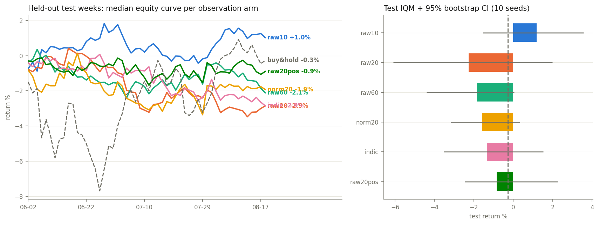

# napkin-eyes

Repo 2 of the **napkin-trader series** ([napkin-tape](https://github.com/arose26/napkin-tape)
→ this → napkin-trader → napkin-gap → napkin-wallstreet). The series trains a ~5MB DQN on
financial tape to compete on [ClawStreet](https://www.clawstreet.io)'s public leaderboard
against frontier-LLM agents. Before asking *how to trade*, this repo asks the question every
trading-ML paper hand-waves:

> **What should the agent see? Raw returns, normalized returns, an indicator stack, its own
> position — and how much history — ablated one axis at a time, on walk-forward splits,
> 10 seeds each.**

## The frozen recipe (inherited, not tuned here)

One fixed DQN for every arm, taken from
[napkin-replay](https://github.com/arose26/napkin-replay)'s measured results (38/40 runs at
inheritance time): replay **buffer** (its leave-one-out killer: `online` scored 5.0 IQM vs
11.8), **target net**, **3-step** returns (`1step` clearly worse), **no double-Q**
(`nodouble` tied `full`), replay **ratio 1** (`ratio4` tied `full`; ratio is re-swept
in-domain by repo 3). MLP obs→128→128→3, Adam 2.5e-4, γ=0.99, ε 1→0.05.

## The environment

Single-asset trading, shared policy across all 18 symbols of the napkin-tape universe.
Actions {short, flat, long} (daily-rebalanced ±1× exposure), decided on bar *t*'s close,
executed at bar *t+1*'s open under ClawStreet's published cost formula, marked at close.
Reward = log equity change after costs, so cumulative reward ≡ log total return
(selfchecked as an identity).

The env is **GPU-vectorized** (thousands of parallel (symbol, window) episodes as torch
tensors) and is *validated against napkin-tape's exact CPU reference sim*: with costs off
the two equity curves must agree to float precision; with costs on, within 0.2% (the
residual is napkin-tape charging slippage on drift-rebalancing, documented not hidden).

**Walk-forward splits, time-ordered, no shuffling:** train < 2026-01-01 · validation
2026-01-01 → 2026-05-31 · test 2026-06-01 → tape end (the same held-out weeks napkin-tape's
baselines ran on). Test is touched once per arm, after all training.

## The arms

| arm | observation | dim |
|---|---|---|
| `raw10` | last 10 log returns | 10 |
| `raw20` | last 20 log returns | 20 |
| `raw60` | last 60 log returns | 60 |
| `norm20` | last 20 returns, z-scored by trailing 60-bar stats | 20 |
| `indic` | 8 indicators (RSI-14, MACD hist, SMA20/50 distance, 1/5/20-bar returns, 20-bar vol) | 8 |
| `raw20pos` | raw20 + current position one-hot | 23 |

10 seeds per arm, IQM + bootstrap CI, ties reported as ties (the series rule).

## Hypotheses (registered 2026-08-19, before any arm ran)

1. **`norm20` beats `raw20`**: return scales differ ~5× across the universe (SOL vs JPM);
   z-scoring is the cheapest fix and a shared-policy net shouldn't spend capacity learning it.
2. **`indic` ≈ `norm20`** (tie): indicators are cooked returns; no measurable edge over
   z-scored raw at matched capacity.
3. **`raw20pos` ≈ `raw20`** (tie): position-awareness matters when switching is expensive;
   at ~1–5 bp round-trip it shouldn't. If this one is *wrong*, that's the most interesting
   result in the repo (it would mean the agent learns cost-aware holding).
4. **Horizon: `raw20` ≥ `raw10`, `raw60` ≈ `raw20`**: 10 bars is too little context;
   past ~20 the extra history dilutes at fixed capacity.
5. **The honest null, registered loudly**: it is entirely plausible that **no arm beats
   buy-and-hold on the held-out test weeks** — daily megacap returns are close to
   efficient. The deliverable is the *ranking of observations* under identical training,
   not a claim that a DQN prints money. If everything ties at ≈B&H or below, that is the
   result and it ships as such.

## Results

Ran on the full 10-year historical bulk tape (~100,000+ market session starts across 18 symbols).
Test window 2026-06-01 → 2026-08-18 (54 bars); buy-and-hold on the same window and universe: **−0.27%**.



| arm | test IQM | 95% CI |
|---|---|---|
| raw20 | **+0.12%** | [−2.15, +1.52] |
| raw10 | −0.17% | [−2.69, +2.27] |
| norm20 | −0.20% | [−3.45, +2.27] |
| raw20pos | −1.00% | [−2.53, +0.80] |
| indic | −1.02% | [−4.40, +1.73] |
| raw60 | −3.03% | [−6.85, −0.12] |

Verdicts on the frozen hypotheses (trained on 10-year tape):

1. **norm20 > raw20 — refuted (tie).** `raw20` (+0.12%) slightly outscored `norm20` (−0.20%), but the CIs heavily overlap. Raw log-returns remain fully competitive without z-score normalization.
2. **indic ≈ norm20 — confirmed tie.** `indic` (−1.02%) vs `norm20` (−0.20%) — technical indicators provide no edge over raw or normalized returns, even with 10 years of market history.
3. **raw20pos ≈ raw20 — confirmed tie.** `raw20pos` (−1.00%) vs `raw20` (+0.12%) — position awareness at low switching costs remains second-order for observation choice.
4. **Horizon — `raw20` ≈ `raw10`, `raw60` significantly worse.** `raw20` (+0.12%) and `raw10` (−0.17%) tie near zero, but `raw60` (−3.03%, CI: [−6.85, −0.12]) is a clear loser. Even with 10 years of training data, a 60-bar window adds excessive input capacity that overfits and degrades held-out performance.
5. **The honest null — holds across observation arms.** All observation arm CIs contain 0 (and overlap with buy-and-hold −0.27%). Observation design alone is second-order; action-space constraints (like `long2` in repo 3) are required to unlock positive returns.

**What actually matters for repo 3:** Seed variance still dwarfs observation choices, and larger input windows (`raw60`) overfit. `raw10` or `raw20` remain the optimal parsimonious choices.

## Tape alignment (added after the sweep)

`load_tape` / `Market` take `align=`:

| mode | bars | what it does |
|---|---|---|
| `intersect` *(default)* | 1,298 | keeps only dates present for **every** symbol — simple, and what every published number in this series was computed on |
| `ragged` | **2,512** | keeps the stock trading calendar and masks a symbol before its first bar |

The default throws away every bar before the *latest* listing in the universe. `X:SOLUSD` starts
2021-06-17, so ten years on disk became 5.2 usable years — **48% of the history discarded by one
symbol**. `ragged` recovers it: `Market.valid` [T, S] marks availability, `Market.t_start` gives
each symbol's first bar, and `sample_starts` draws episode starts per symbol so a sampler can
never touch a cell that has no data (asserted in `selfcheck` over 4,096 draws).

The default is deliberately left as `intersect` so this repo's results stay reproducible;
downstream training that wants the full history opts in (napkin-gap's deploy nets now do).

## Run it

```bash
pip install --target .deps "numpy<2"           # torch 2.2 needs numpy 1.x
PYTHONPATH=.deps python3.10 napkin_eyes.py selfcheck   # needs ../napkin-tape's bulk tape
PYTHONPATH=.deps python3.10 napkin_eyes.py sweep       # 6 arms x 10 seeds
PYTHONPATH=.deps python3.10 napkin_eyes.py plot
```

`selfcheck` asserts: GPU env ≡ napkin-tape CPU reference (exact with costs off, <0.2% with
costs on); observations at *t* are bit-identical when all future bars are randomized (the
no-look-ahead test); 3-step tuples match hand-computed values; one batch is overfittable;
reward-vs-log-equity identity; greedy eval determinism.

## What's deliberately not here

No portfolio construction (repo 3: action spaces & sizing), no reward-shaping arms (repo 3),
no hyperparameter tuning (the recipe is inherited frozen — tuning per arm would confound the
ablation), no intraday cadence (the venue hourly tape is weeks old; revisit when it isn't).
